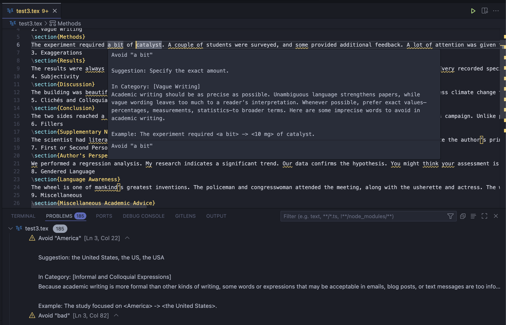

# latex-non-academic-word-check

Check and highlight non-academic words for latex.

Word Sources:

1. https://proofreading.org/blog/words-to-avoid-in-academic-writing/
2. https://holmes.ccsd59.org/wp-content/uploads/sites/11/2019/09/Words-to-Avoid-1.pdf

Usage:

1. Auto check active editor;
2. Use command: `Latex NAWC: Check All .tex Files in Project`

Screenshots:

# Change Logs

1. 0.3.0: ignore latex command, e.g. `\small`
